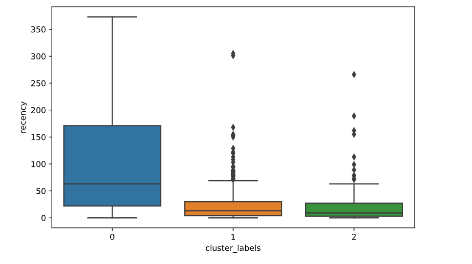
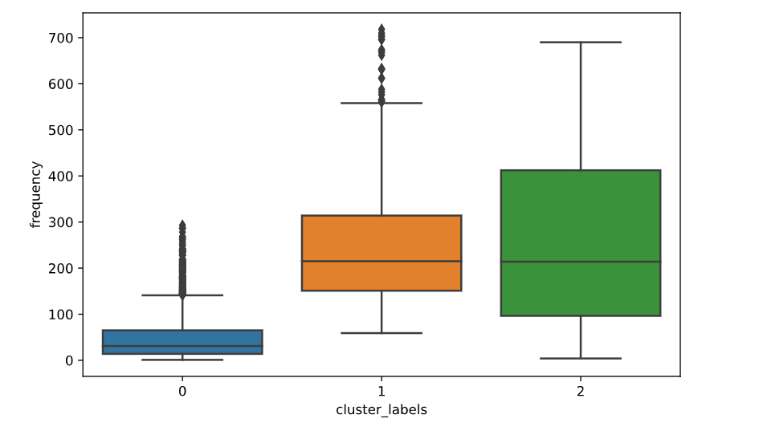
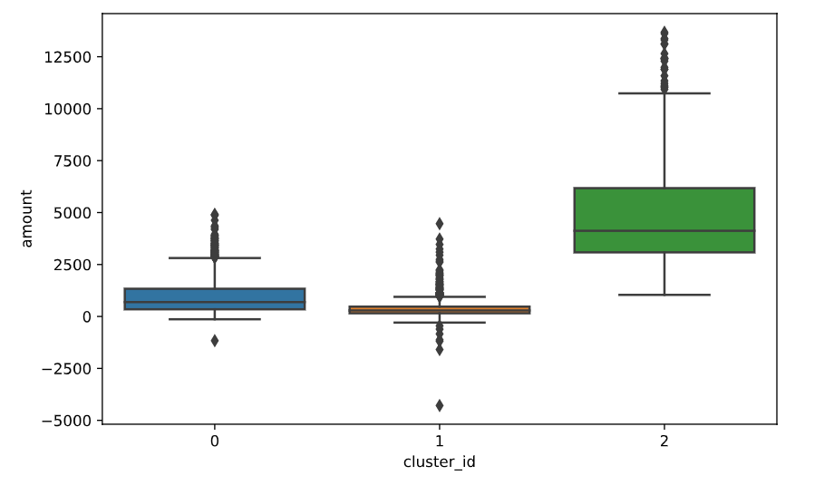

## CustomersClusterization

### Провел небольшой анализ данных и сделал кластеризацию покупателей на 3 группы с помощью алгоритма k-means clustering (метод k-средних) и анализа RFM(Recency, Frequency, Monetary)

### Это могло бы помочь бизнесу выбрать лучший набор клиентов, на которых должна ориентироваться компания.

### в data/ лежат данные. в src/ есть Jypiter Notebook с анализом и комментариями, а также .py модель, в img/ графики

#### Данные взяты отсюда https://www.kaggle.com/hellbuoy/online-retail-customer-clustering

### Подробнее о данных и компании:
#### В датасете представлены данные Британской компании по продаже подарков в период между 01/12/2010 - 09/12/2011. Большинство покупателей - оптовики.

### Бизнес-цель:
#### Построить RFM-кластер и выбрать лучший набор клиентов, на которых должна ориентироваться компания.

### Доступные данные: 
#### InvoiceNo - номер счёта
#### StockCode - торговый код
#### Description - описание товара
#### Quantity - количество
#### InvoiceDate - дата выставления счёта
#### UnitPrice - цена товара
#### CustomerID - ID покупателя
#### Country - страна

### Используя модель анализа RFM я добавил 3 переменные определяющие кластеры
#### R (Recency(Давность)): Количество дней с последнего заказа
#### F (Frequency(Частота)): Количество транзакций
#### M (Monetary(Деньги)): Общая выручка

### Вывод
#### С помощью RFM-анализа можно судить о типе маркетинга, который следует использовать для нацеливания на клиентские сегменты и для перемещения их между сегментами.
#### Частота и денежные значения расчитывают пожизненную ценность клиента (CLV); Новизна может показать вернётся ли клиент скова.
#### Получили 3 кластера где:
#### 2-Лучший покупатель, т.е высокая лояльность, большое кол-во покупок и их частота
#### 1-Пассивный клиент - нечастый клиент с низкой суммой покупок и их частотой
#### 0-Потенциальный покупатель: покупатель недавно совершил покупку несколько раз

### График показывающий давность(в днях) с последней покупки для каждого кластера

### График показывающий частоту(количество) транзакций для каждого кластера

### График показывающий выручку для каждого кластера

